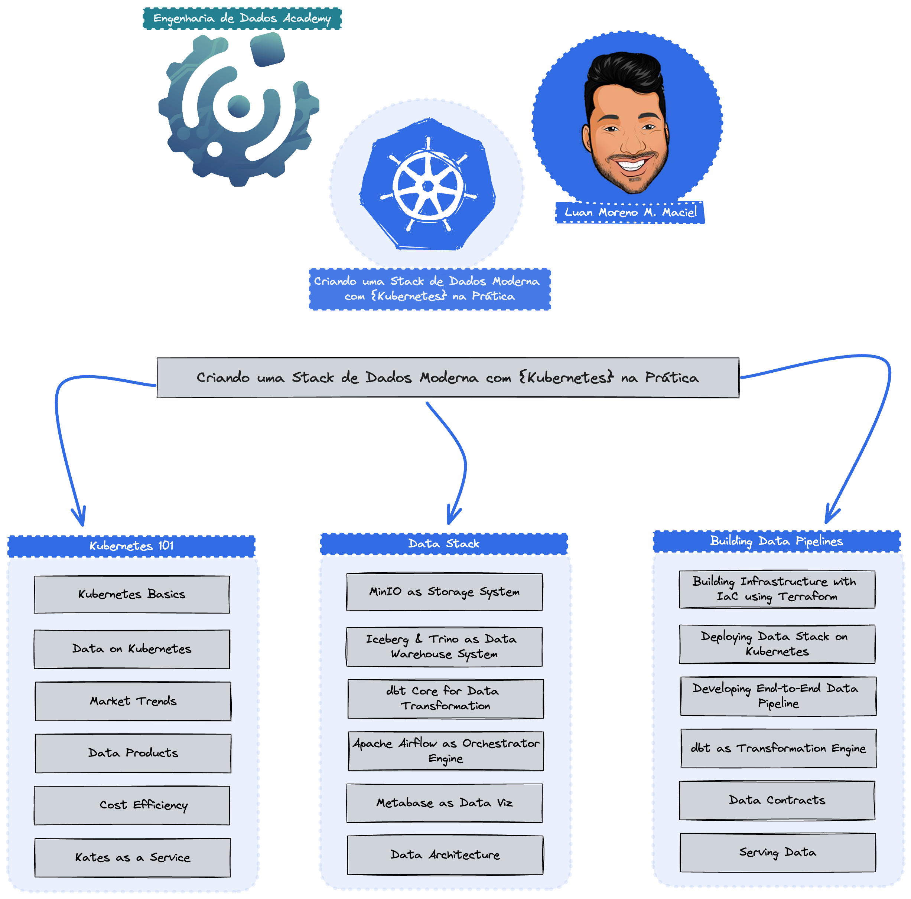

# Dados no Kubernetes [DoK]
### ws-stack-dados-k8s

Nesse workshop vamos aprender a criar um ambiente de dados no kubernetes utilizando os mais famosos
produtos open-source do mercado de dados.

Esse projeto está estruturado em 3 partes:
- [infra](#infra)
- [apps](#apps)
- [data](#data-cluster)

### infra
Todos os recursos necessários para criar um cluster de kubernetes assim como os compomentes necessários
para o ambiente de dados utilizando GitOps.

Para deployment do ambiente, siga os passos:
1) [Kubernetes](https://github.com/owshq-academy/ws-stack-dados-k8s/blob/cce5c1e4ca78e19f58c114a4f6f5ee25c5b5332a/infra/terraform/kubernetes/aks/orion-development/readme.md)
2) [GitOps](https://github.com/owshq-academy/ws-stack-dados-k8s/blob/e6a934db161f71a691374bfd57192e7cad8d4a3b/infra/terraform/gitops/argocd/readme.md)
3) [Deployment](https://github.com/owshq-academy/ws-stack-dados-k8s/blob/e6a934db161f71a691374bfd57192e7cad8d4a3b/infra/src/readme.md)

### apps
Desenvolvimento de uma aplicação que cria arquivos em json ou parquet para colocar na pasta de landing zone
de uma data lake, nesse caso utilizando MinIO (s3).

Para entendimento da aplicação, siga os passos:
1) [Data Gen DataStores](https://github.com/owshq-academy/ws-stack-dados-k8s/blob/6c3b885f044d67ac60f6ee2d6e6fca5dcc5e0fa2/app/data-gen-datastores/readme.md)

### data
Criação de um pipeline de dados utilizando Apache Airflow, Trino & dbt-Core para criar um ambiente de dados
completo fim a fim.

Para a construção do ambiente de dados, siga os passos:
1) [Trino](https://github.com/owshq-academy/ws-stack-dados-k8s/blob/e6a934db161f71a691374bfd57192e7cad8d4a3b/data/sql)
2) [dbt_Core](https://github.com/owshq-academy/ws-stack-dados-k8s/blob/8abc244ebdaa999021a76777ac5362ba5956c40d/data/dags/dbt/owshq)
3) [Apache Airflow](https://github.com/owshq-academy/ws-stack-dados-k8s/blob/8abc244ebdaa999021a76777ac5362ba5956c40d/data/dags/dbt_sql_transform.py)

### links
- [Kubernetes](https://kubernetes.io/docs/home/)
- [Digital Ocean](https://www.digitalocean.com/)
- [HoneyPot Kubernetes Part 1](https://www.youtube.com/watch?v=BE77h7dmoQU)
- [HoneyPot Kubernetes Part 2](https://www.youtube.com/watch?v=318elIq37PE)
- [KubeCost](https://www.kubecost.com/)
- [AptKube](https://aptakube.com/)
- [ArgoCD](https://argoproj.github.io/argo-cd/)
- [MinIO](https://min.io/)
- [Trino](https://trino.io/)
- [Apache Iceberg](https://iceberg.apache.org/)
- [Trino & Iceberg](https://trino.io/docs/current/connector/iceberg.html)
- [dbt](https://www.getdbt.com/)
- [Apache Airflow](https://airflow.apache.org/)
- [OpenMetadata](https://open-metadata.org/)
- [Docker](https://www.docker.com/)
- [Terraform](https://www.terraform.io/)
- [Terragrunt](https://terragrunt.gruntwork.io/)
- [InfraCost](https://www.infracost.io/)
- [OpenTofu](https://opentofu.org/)
- [Helm](https://helm.sh/)
- [Kustomize](https://kustomize.io/)
- [Astronomer Cosmos](https://astronomer.github.io/astronomer-cosmos/index.html)
- 